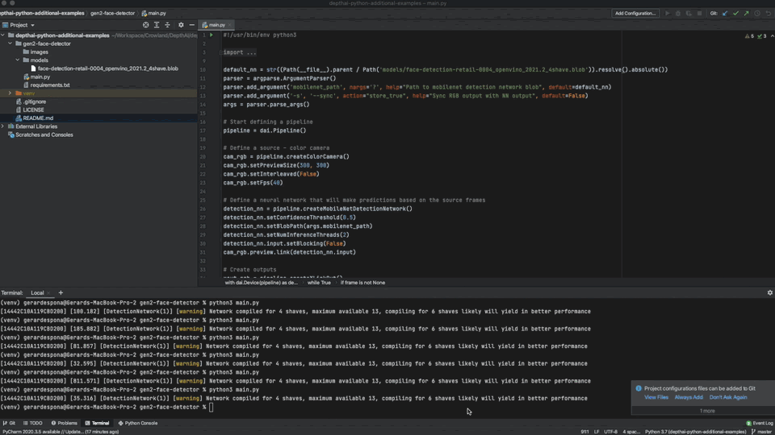

# depthai-python-additional-examples
My own python additional examples using DepthAI

If you look for the same examples for C++ take a look here https://github.com/gespona/depthai-core-additional-examples

If you look for the same examples inside Unity take a look here https://github.com/gespona/depthai-unity-plugin

# Usage

Strongly recommend to use PyCharm as suggested on the basic tutorials from DepthAI

So it creates venv for you and not messing with system installation when install requirments

# Installation

Each folder contains one example with own requirements and models

# Examples

## gen2-face-detector



Face detector from modelplace.ai

```
cd gen2-face-detector
pip install -r requirements
python3 main.py 
```

## Repo kickstarted from depthai python examples

If you find this repo interesting please star / watch to stay tunned !